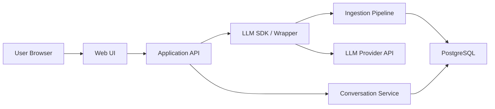
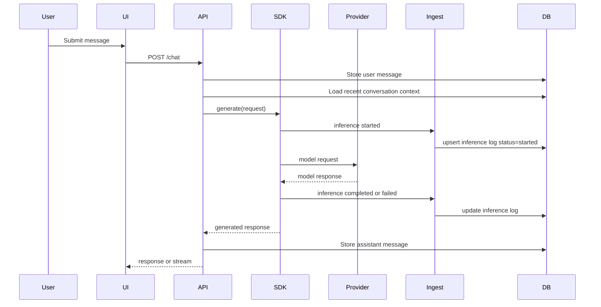

# High-Level Design

## Goal

Build a lightweight but production-minded inference logging and ingestion system for an LLM chatbot. The system should satisfy the assignment's required scope:

1. Chatbot application with multi-turn conversations and a simple UI
2. Lightweight SDK or wrapper around LLM calls that captures inference metadata
3. Ingestion pipeline that receives, validates, parses, and stores logs
4. Database storage for chat messages, inference logs, and extracted metadata

The design below keeps `1-4` inside one project while maintaining clear boundaries between responsibilities.

## Recommended Scope

### Required

- Multi-turn chatbot UI
- Backend API for chat and conversations
- LLM wrapper that instruments every model call
- Ingestion endpoint and processing layer
- PostgreSQL storage
- README, architecture notes, and demo

### Recommended Bonus Scope

- Docker Compose one-command setup
- Streaming responses
- Frontend support for listing, resuming, and cancelling conversations
- Gemini as a second provider on top of the primary Cerebras integration

### Explicitly Out of Scope for First Pass

- Kubernetes
- Event bus or message broker
- PII redaction
- Full dashboards
- Production authentication and multi-tenant access control

## Recommended Stack

Use a stack that is fast to build, easy to demo, typed end to end, and still clean enough to discuss in an interview:

- `TypeScript` across the full stack
- `pnpm` workspace monorepo
- `Next.js` for the frontend UI
- `Fastify` for the backend API
- `PostgreSQL` for persistence
- `Drizzle ORM` for schema and migrations
- `Zod` for request and payload validation
- `Vercel AI SDK` for streaming ergonomics and model abstraction
- `Tailwind CSS` for a fast but polished UI
- `Vitest` and `Supertest` for backend tests
- `Docker Compose` for local orchestration

This can live in a single repo and still feel like one coherent application.

## Locked Technical Choices

These are the concrete implementation choices to build against:

- `apps/web`: `Next.js` chat application
- `apps/api`: `Fastify` API for chat, conversations, and ingestion
- `packages/llm-gateway`: our thin internal gateway or wrapper around provider calls
- `packages/shared`: shared Zod schemas, TypeScript types, constants, and error shapes
- `PostgreSQL + Drizzle`: schema, migrations, and query access
- `Docker Compose`: local stack for web, API, and database

This gives us a clean separation between application logic and inference instrumentation without requiring microservices.

## Provider Strategy

We will support two providers:

### Primary Provider

- `Cerebras`
- Default model: `gpt-oss-120b`

Why it is the primary:

- You already have an API key
- It supports fast inference and streaming
- It returns useful usage and timing metadata
- It fits the assignment without forcing paid OpenAI or Anthropic usage

### Secondary Provider

- `Google Gemini`
- Default model: `gemini-2.5-flash`
- Low-cost fallback model: `gemini-2.5-flash-lite`

Why we include it:

- It gives us a real multi-provider story
- It is useful for the bonus scope
- It gives us a cheaper backup path if Cerebras rate limits become annoying

### Design Principle

- `Cerebras` is the default provider for the first working version
- `Gemini` is included in the roadmap and should be supported through the same normalized gateway interface
- Provider selection should come from config first, not from a large UI feature

## Proposed Repository Shape

```text
/
  apps/
    web/                # Chat UI
    api/                # Chat API, conversations API, ingestion API
  packages/
    llm-gateway/        # Lightweight wrapper around provider calls
    shared/             # Shared types, schemas, constants
  infrastructure/
    docker/             # Compose files or helper scripts
  docs/
    architecture/       # Optional extra notes if you want them separate
```

If you want to keep it even smaller, `apps/api` and `packages/llm-gateway` can still be separated logically inside one backend app.

## Core Architecture



## Main Components

### 1. Web UI

Responsibilities:

- Render the chatbot interface
- Start a conversation or resume an existing one
- Send user messages to the backend
- Display assistant replies
- Show loading, streaming, error, and cancelled states

Important constraints:

- The browser must never call the model provider directly
- Provider API keys stay server-side only
- The UI should remain responsive even if log ingestion fails

### 2. Application API

Responsibilities:

- Accept chat requests from the UI
- Load recent conversation context
- Persist user messages
- Call the LLM through the SDK
- Persist assistant messages
- Expose conversation listing and detail routes
- Expose a cancellation route if you implement the bonus

Design note:

This API is the orchestration layer. It should not know provider-specific details beyond choosing a provider/model configuration.

### 3. LLM SDK / Wrapper

Responsibilities:

- Normalize LLM calls behind one interface
- Measure timing and capture metadata
- Attach conversation and request correlation identifiers
- Record success and failure status
- Generate safe previews of prompts and responses
- Emit logs to the ingestion pipeline in near real time

Suggested interface:

```ts
interface GenerateRequest {
  conversationId: string;
  userMessageId: string;
  provider: "cerebras" | "gemini";
  model: string;
  messages: Array<{ role: "system" | "user" | "assistant"; content: string }>;
  stream?: boolean;
}

interface GenerateResult {
  text: string;
  finishReason?: string;
  usage?: {
    inputTokens?: number;
    outputTokens?: number;
    totalTokens?: number;
  };
}
```

The wrapper is the heart of the assignment. It turns a plain provider call into a traceable inference event.

### 4. Ingestion Pipeline

Responsibilities:

- Receive logs from the SDK
- Validate payload shape
- Reject malformed or oversized payloads
- Normalize metadata into a stable schema
- Persist structured records to the database

Design principle:

The ingestion boundary should be independent of the chat path. Even if chat and ingestion live in one backend app, they should be separate modules with separate validation and persistence logic.

### 5. Database

Responsibilities:

- Store conversations
- Store messages
- Store inference logs
- Support listing and resuming conversations
- Support operational queries like recent failures and latency trends

## End-to-End Flow



## Conversation Context Strategy

The assignment asks for short conversational context, not unlimited memory. Keep the strategy simple and explicit:

- Always include a fixed system prompt
- Include the last `N` user/assistant turns, for example 6-10 messages
- Enforce a soft token or character budget
- Trim oldest messages when the budget is exceeded
- Store full history in the database, but send only recent context to the provider

Why this is good:

- Easy to implement
- Predictable token cost
- Meets the assignment without requiring summarization

Potential improvement later:

- Add conversation summarization for long threads

## Data Model

### Conversations

One row per chat thread.

Suggested fields:

- `id`
- `title`
- `status` (`active`, `completed`, `errored`, `cancelled`)
- `created_at`
- `updated_at`
- `last_message_at`

### Messages

One row per message in a conversation.

Suggested fields:

- `id`
- `conversation_id`
- `role` (`system`, `user`, `assistant`)
- `content`
- `content_preview`
- `status` (`completed`, `partial`, `failed`, `cancelled`)
- `sequence_number`
- `provider_message_id` nullable
- `created_at`

### Inference Logs

One row per LLM invocation.

Suggested fields:

- `id`
- `conversation_id`
- `user_message_id`
- `assistant_message_id` nullable
- `request_id`
- `provider`
- `model`
- `status` (`started`, `completed`, `failed`, `cancelled`, `timed_out`)
- `started_at`
- `completed_at` nullable
- `latency_ms` nullable
- `time_to_first_token_ms` nullable
- `input_tokens` nullable
- `output_tokens` nullable
- `total_tokens` nullable
- `finish_reason` nullable
- `request_preview`
- `response_preview` nullable
- `error_code` nullable
- `error_message` nullable
- `http_status` nullable
- `raw_metadata` JSONB
- `created_at`
- `updated_at`

### Why This Schema Is Sensible

- It supports the assignment requirements directly
- It allows conversation browsing without joining on raw logs every time
- It makes operational queries easy
- It stores both structured fields and flexible provider-specific metadata

## Ingestion Strategy

### Payload Shape

The SDK should emit a normalized payload regardless of provider:

```json
{
  "eventId": "uuid",
  "requestId": "uuid",
  "conversationId": "uuid",
  "userMessageId": "uuid",
  "provider": "cerebras",
  "model": "gpt-oss-120b",
  "status": "completed",
  "startedAt": "2026-05-22T10:00:00.000Z",
  "completedAt": "2026-05-22T10:00:01.230Z",
  "latencyMs": 1230,
  "usage": {
    "inputTokens": 250,
    "outputTokens": 80,
    "totalTokens": 330
  },
  "requestPreview": "User asked about refund status...",
  "responsePreview": "Your refund is currently being processed...",
  "error": null,
  "metadata": {
    "finishReason": "stop"
  }
}
```

### Delivery Approach

For the take-home, the best tradeoff is:

- keep a public ingestion endpoint
- reuse the same validation and persistence service internally
- do not introduce Kafka, RabbitMQ, or Redis unless absolutely necessary

You can say:

- the SDK emits logs in near real time
- the ingestion endpoint is available for external clients
- the reference app also supports in-process ingestion for simplicity

This is a strong tradeoff for a lightweight system.

## Failure Handling

### Principle

Chat should degrade gracefully if log ingestion has a problem. Logging is important, but the user experience should not fail unnecessarily because metadata persistence had a transient issue.

### Chat Path Rules

- If provider call fails:
  - return a clean error to the UI
  - store the failure in `inference_logs`
  - do not create a completed assistant message
- If message persistence fails before provider call:
  - fail the request immediately
  - do not call the model
- If ingestion fails after a successful provider response:
  - return the chat response
  - record a server warning
  - optionally retry logging once

### Ingestion Rules

- Reject invalid payloads with `400`
- Reject unsupported status/provider values with `422`
- Protect against duplicate events using unique `event_id` or `request_id`
- Enforce max preview lengths
- Never trust provider-supplied values without validation

### Cancellation Rules

If you implement cancellation:

- mark the inference as `cancelled`
- store any partial assistant content as `partial` or discard it consistently
- return a distinct UI state instead of a generic error

## Edge Cases to Handle

### Product and UX

- User submits an empty prompt
- User submits a prompt that exceeds max length
- Double-submit from repeated button clicks
- User refreshes during an in-flight request
- Conversation not found when resuming from the list

### Model and Provider

- Provider timeout
- Provider rate limit
- Provider returns malformed usage data
- Streaming ends early
- Model returns empty text with a `stop` finish reason

### Persistence

- Database temporarily unavailable
- Conversation exists but latest message write fails
- Duplicate ingestion event replay
- Foreign key mismatch between message and conversation identifiers

### Operational

- Clock skew causing odd timestamps
- Logs arriving out of order
- Same request retried by the frontend
- Partial metadata when the provider errors before usage is returned

## Security and Privacy

For the assignment, keep this practical:

- Keep provider API keys only on the server
- Do not log full prompts and responses by default
- Store previews with a strict length cap
- Consider hashing full content if you want deduplication without storing everything in logs
- Sanitize error messages before returning them to the UI
- Add basic rate limiting to chat and ingestion endpoints

If you do not implement PII redaction, call that out honestly in the tradeoffs section.

## Observability

Even a lightweight project should expose basic operational signals:

- structured server logs
- request IDs on every API request
- latency measurement around provider calls
- count of successful vs failed inferences
- database health check endpoint

Good demo-friendly endpoints:

- `GET /health`
- `GET /ready`

## Scalability Notes

This system does not need heavy infrastructure for the assignment, but it should show good instincts.

### What Scales Well in This Design

- Stateless API processes
- PostgreSQL with indexes on `conversation_id`, `created_at`, `status`
- Provider abstraction that allows adding more models later
- Separated ingestion validation logic

### Likely Bottlenecks

- synchronous provider latency
- database writes for every message and log
- expensive conversation reloads for long threads

### Next Steps If This Grew

- async log buffering or outbox pattern
- background workers for non-critical writes
- read model for dashboards
- summary-based context compression
- external queue for ingestion bursts

## Recommended Bonus Strategy

### Highest ROI

1. `Docker Compose`
2. `Streaming responses`
3. `List conversations`
4. `Resume conversation`
5. `Cancel conversation`
6. `Gemini as a second provider`

### Good If Time Permits

1. Basic latency and error summary page
2. Provider switch via config or admin setting

### Not Worth It for This Submission

1. Self-hosted Kubernetes
2. Event-driven architecture with extra infrastructure unless the core app is already excellent

## Why This Design Is Strong for the Assignment

- It satisfies all required areas `1-4`
- It keeps everything in one project without becoming tangled
- It demonstrates good production instincts without overengineering
- It leaves clear room for bonus features
- It gives you honest tradeoffs you can defend in an interview

## Suggested Talking Points for the README

- The system is intentionally lightweight but designed with clean boundaries
- Logging is decoupled logically from chat handling, even when deployed together
- The schema favors practical queryability over hyper-normalization
- Context is intentionally short-window based to control token usage
- Bonus work focused on developer experience and user-facing value rather than infrastructure theater

## Delivery Roadmap

### Phase 1: Core Working System

- Build the chat UI
- Build the API and conversation persistence
- Integrate `Cerebras` through the internal gateway
- Capture inference logs and store them in PostgreSQL
- Support basic multi-turn chat and conversation resume

### Phase 2: High-Value Product Improvements

- Add streaming responses
- Add list/resume/cancel conversation flows in the UI
- Add Docker Compose for one-command local setup

### Phase 3: Multi-Provider Expansion

- Add `Gemini` to the same gateway interface
- Normalize provider-specific usage and error fields
- Allow provider/model selection through environment config
- Compare behavior and tradeoffs between Cerebras and Gemini in the README
